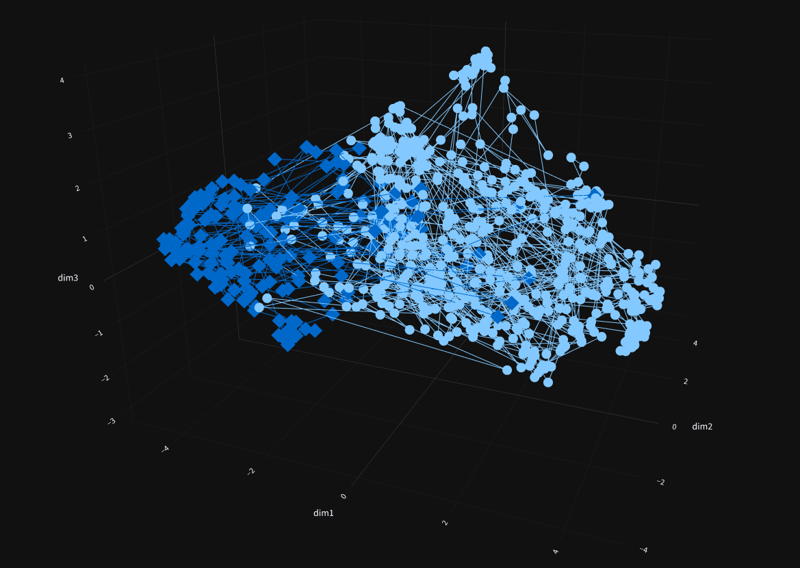

# GraphIt — High-Dimensional Semantic Manifold Laboratory

> Project high-dimensional text embeddings into 3D–6D coordinate spaces. Analyze semantic clusters, detect document overlap, and interrogate the latent geometry of language — interactively.

---

## What Is GraphIt?

GraphIt is a Streamlit-based analytical laboratory for visualizing and comparing text embeddings. It takes raw text from up to **10 sources**, vectorizes each sentence using state-of-the-art Hugging Face sentence transformers, and projects the resulting high-dimensional vectors into a navigable coordinate space using your choice of manifold learning algorithm.

The result: a spatial, mathematical audit of how documents relate to one another — not just as keyword matches, but as geometric neighbors in semantic space.

---

## Core Capabilities


## Examples

### Semantic Trajectory (Line Plot)


### Vector Field (Local Semantic Transitions)


### 🔵 Manifold Dimensionality Reduction

Four fully tunable reduction algorithms, each with its own hyperparameter panel in the sidebar:

| Algorithm | Strengths | Configurable Parameters |
|:---|:---|:---|
| **PaCMAP** | Superior global structure retention | `n_neighbors`, `MN_ratio`, `FP_ratio`, `lr`, `num_iters`, `distance`, `init`, `apply_pca` |
| **UMAP** | Topological fidelity, fast at scale | `n_neighbors`, `min_dist`, `distance metric` |
| **PCA** | Linear, deterministic baseline | `svd_solver`, `whiten` |
| **t-SNE** | Dense local cluster resolution | `perplexity`, `learning_rate`, `max_iter` *(3D only, Barnes-Hut)* |

> **t-SNE constraint:** Perplexity must be less than the total sentence count across all sources. The application validates this at runtime and halts with a descriptive error if violated.

All algorithms support output dimensions **3 through 6** (except t-SNE, which is locked to 3D for performance reasons). A **scale multiplier** is available across all reducers to stretch the coordinate space for visual clarity.

---

### 🟣 Multi-Dimensional Visual Encoding

GraphIt maps dimensionality to visual channels, enabling you to encode up to 6 semantic dimensions simultaneously:

| Dimensions | Plot Types Available | Encoding Logic |
|:---|:---|:---|
| **3D** | Scatter, Line, Scatter Matrix | X, Y, Z coordinates |
| **4D** | Scatter, Scatter Matrix | X, Y, Z + continuous color (`dim4`) |
| **5D** | Scatter | X, Y, Z + color (`dim4`) + marker size (`dim5`, forced absolute) |
| **6D** | Cone Plot | X, Y, Z position + U, V, W trajectory vectors |

> **5D note:** `dim5` is converted to its absolute value before mapping to marker size, ensuring all size values are non-negative.

> **6D note:** The cone plot renders trajectory direction and magnitude from the 4th–6th reduction components. Cone `sizemode` (`scaled` / `absolute`) and `sizeref` are configurable via the sidebar.

Color scales for 4D+ visualizations: `Viridis`, `Cividis`, `Plasma`, `Inferno`, `Magma`, `Turbo`.

---

### 🟡 Pre-Reduction Analytics

Before any dimensional collapse occurs, GraphIt processes the raw high-dimensional embeddings directly:

**Cosine Similarity Matrix**
For each pair of sources, every sentence in Source A is compared against every sentence in Source B. The nearest-neighbor sentence from Source B is returned alongside its similarity score. Results are presented as a sortable DataFrame and a bar chart — with full hover detail including both matched sentences and their respective sources. All pairwise source combinations are computed automatically.

**Grand Tour Projection**
A 2D animated scatter plot that cycles through adjacent dimension pairs of the original embedding space (dim0→dim1, dim1→dim2, ...). This reveals the raw structural geometry of the data before reduction distorts global relationships. Fully configurable animation:

| Control | Description |
|:---|:---|
| Point Size | Marker size in the animated scatter |
| Frame Duration | Milliseconds per animation frame |
| Transition Duration | Milliseconds for interpolation between frames |
| Easing Function | `cubic-in-out`, `elastic-in-out`, `bounce-in-out`, and 6 more |

---

### 🟢 Post-Reduction Metrics

After reduction, GraphIt surfaces a full suite of spatial statistics on the reduced coordinate system:

- **Extremes per dimension** — which sentence sits at the maximum and minimum of each axis, with its source label
- **Magnitude analysis** — Euclidean distance from origin for every point; identifies the max, min, and median-magnitude sentences
- **Centroid per source** — mean position of each document's sentences in reduced space; reveals how far apart document clusters sit
- **Standard deviation per source** — spread of each source's sentences around its centroid; a measure of internal semantic coherence
- **Full describe()** — statistical summary of all reduced dimensions
- **Sentence and source counts** — unique sentence count, total sentence count, sentences per source

---

### 🔴 Automated Text Sanitization Pipeline

Twelve configurable preprocessing options, applied before tokenization and embedding:

| Setting | Description |
|:---|:---|
| Fix Unicode | Normalizes malformed unicode characters |
| Convert to ASCII | Transliterates to ASCII |
| Lowercase | Converts all text to lowercase |
| Remove URLs | Strips hyperlinks |
| Remove Emails | Strips email addresses |
| Remove Numbers | Strips numeric tokens |
| Remove Square Brackets `[...]` | Regex removal including contents |
| Remove Curly Braces `{...}` | Regex removal including contents |
| Remove Parentheses `(...)` | Regex removal including contents |
| Remove Special Characters | Strips `# * ~ ^ \| < >` |
| Remove Extra Whitespace | Collapses runs of whitespace |
| Language | Cleaning language context (`en`, `es`, `fr`, `de`, `it`, `pt`) |

A **post-cleaning preview** is rendered before processing so you can verify sanitization output before committing to embedding.

---

## Embedding Models

21 models available, spanning 5 architectural families. The active model's Hugging Face Model Card is linked directly in the sidebar.

**MiniLM**
- `all-MiniLM-L6-v2`
- `all-MiniLM-L12-v2`
- `paraphrase-MiniLM-L6-v2`
- `paraphrase-MiniLM-L12-v2`

**MPNet**
- `all-mpnet-base-v2`
- `paraphrase-mpnet-base-v2`
- `multi-qa-mpnet-base-dot-v1`

**DistilRoBERTa / DistilBERT / Albert**
- `all-distilroberta-v1`
- `paraphrase-distilroberta-base-v1`
- `multi-qa-distilbert-cos-v1`
- `paraphrase-albert-small-v2`

**BGE (BAAI)**
- `bge-small-en-v1.5`
- `bge-base-en-v1.5`
- `bge-large-en-v1.5`

**E5 (intfloat)**
- `e5-small-v2`
- `e5-base-v2`
- `e5-large-v2`

**Multilingual** *(auto-detected and labeled in the UI)*
- `distiluse-base-multilingual-cased-v2`
- `paraphrase-multilingual-MiniLM-L12-v2`
- `LaBSE`
- `multi-qa-MiniLM-L6-cos-v1`

> Models are loaded with `@st.cache_resource` — the model is downloaded once and held in memory for the session, eliminating redundant reload overhead across runs.

---

## Technical Stack

| Layer | Technology |
|:---|:---|
| Application Framework | [Streamlit](https://streamlit.io/) |
| Embedding Models | [sentence-transformers](https://www.sbert.net/) (Hugging Face) |
| Manifold Learning | [PaCMAP](https://github.com/YingfanWang/PaCMAP), [UMAP](https://umap-learn.readthedocs.io/), [scikit-learn](https://scikit-learn.org/) |
| Numerical Computing | NumPy, Pandas, SciPy |
| Visualization | [Plotly](https://plotly.com/python/) |
| Tokenization | NLTK (`punkt`) |
| Text Sanitization | `cleantext`, `re` |

---

## Repository Structure

```text
GraphIt/
├── .gitignore                   # Version control exclusion rules
├── README.md                    # This document
├── requirements-lock.txt        # Exact frozen environment versions
├── requirements.txt             # Minimal dependency manifest
├── semantic_similarity_lab.py   # Streamlit UI, sidebar controls, session state, layout
├── process_functions.py         # Embedding pipeline, reduction dispatch, all plot generators, metrics
└── utils.py                     # Text cleaning, model loading, reduction math, dataframe constructors
```

---

## Quick Start

```bash
pip install -r requirements.txt
streamlit run semantic_similarity_lab.py
```

> For exact reproducibility, use `requirements-lock.txt` instead.

---

## Installation

> Requires **Python 3.9+**. A virtual environment is strongly recommended.

```bash
# 1. Clone
git clone https://github.com/CzrOtz/GraphIt.git
cd GraphIt

# 2. Create and activate virtual environment
python -m venv venv
source venv/bin/activate        # Windows: venv\Scripts\activate

# 3. Install dependencies
pip install -r requirements.txt

# 4. Launch
python -m streamlit run semantic_similarity_lab.py
```

---

## Operational Workflow

**1 — Configure the Engine**
Select an embedding model from the sidebar. The UI will indicate whether the selected model supports multilingual input. Choose a reduction algorithm and expand its settings panel to tune hyperparameters.

**2 — Ingest Text**
Paste text into the document containers (2–10 sources). Label each source. A minimum of 3 sentences per source is required for manifold reduction. A minimum of 2 sources is required for cosine similarity analysis.

**3 — Sanitize**
Expand *Clean Text Settings* and toggle preprocessing options. After clicking **Process Text**, a collapsible preview shows the cleaned output before embedding begins.

**4 — Select Processing Scope**
- **Pre-reduction only** — cosine similarity matrix + Grand Tour animation
- **Post-reduction only** — manifold projection + all spatial plots + metrics
- **Both** — full pipeline

**5 — Analyze**
Interact with the Plotly figures (rotate, zoom, hover for sentence detail). Review the metrics tables for centroid positions, standard deviations, and magnitude extremes.

---

## Contributing

GraphIt is open source and built for the community.

- [**Fork the Repository**](https://github.com/CzrOtz/GraphIt)
- [**Submit a Pull Request**](https://github.com/CzrOtz/GraphIt/pulls)
- [**Report an Issue**](https://github.com/CzrOtz/GraphIt/issues)